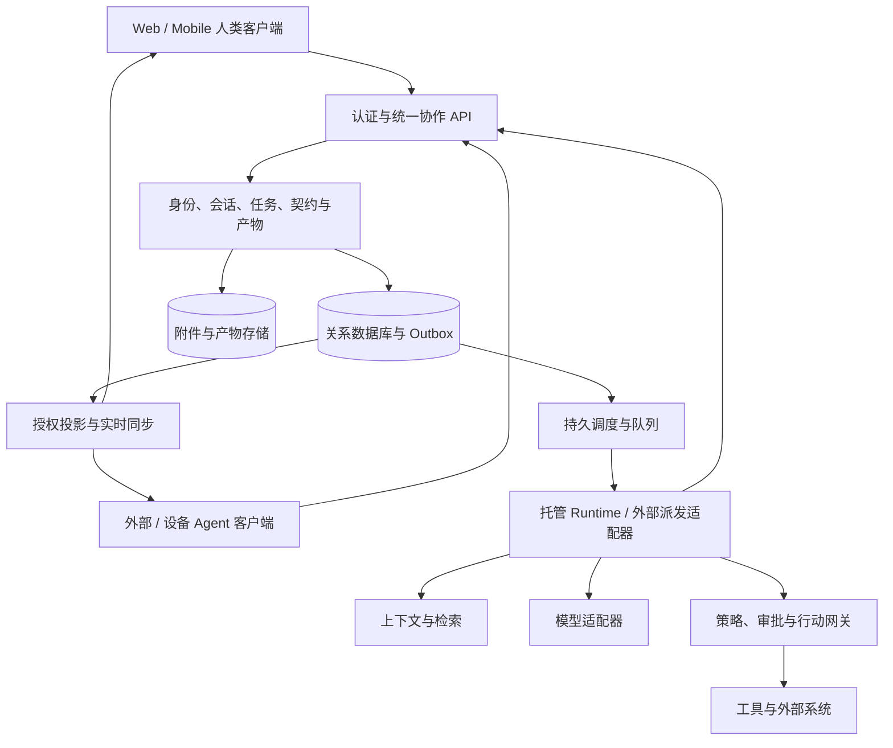

# Imbox：AI 原生即时通信与协作系统设计

> 让人和 Agent 在同一个通信空间中交流、承担任务、持续工作并交付可验证的结果。

| 项目 | 内容 |
|---|---|
| 文档版本 | 2.0 |
| 更新日期 | 2026 年 10 月 4 日 |
| 状态 | 产品与系统设计基线；用于原型、接口设计、实现和验收 |
| 适用范围 | 人与人、人和 Agent、Agent 之间的即时通信与持续协作 |
| 前置材料 | 《面向 AI Agent 时代的即时通信产品设计》v1.1，以及本次产品方案讨论 |
| 维护方式 | 使用稳定文件名，版本与变更记录保留在文档内部；实现偏离需记录设计决策 |

本文定义目标行为与实现约束，不表示所列能力已经实现。文中“必须”是安全、数据一致性或 V1 验收要求；“应”是默认设计，偏离需说明；“可”是可选方案。阶段规划以第 22 节为准，未来能力不自动进入 V1。

## 目录

1. [产品定义与设计目标](#1-产品定义与设计目标)
2. [设计原则与系统不变量](#2-设计原则与系统不变量)
3. [产品形态与用户体验](#3-产品形态与用户体验)
4. [身份、Agent 与执行位置](#4-身份agent-与执行位置)
5. [协作关系与工作契约](#5-协作关系与工作契约)
6. [领域模型与数据约束](#6-领域模型与数据约束)
7. [状态机与生命周期](#7-状态机与生命周期)
8. [多人和多-Agent-协调](#8-多人和多-agent-协调)
9. [持久运行与调度](#9-持久运行与调度)
10. [Agent-原生接口与接入协议](#10-agent-原生接口与接入协议)
11. [事件模型与兼容策略](#11-事件模型与兼容策略)
12. [上下文、记忆与搜索](#12-上下文记忆与搜索)
13. [授权、隐私与安全边界](#13-授权隐私与安全边界)
14. [工具、行动与外部副作用](#14-工具行动与外部副作用)
15. [产物、版本与共同编辑](#15-产物版本与共同编辑)
16. [实时同步、离线与可靠性](#16-实时同步离线与可靠性)
17. [系统架构与部署](#17-系统架构与部署)
18. [客户端与开发者体验](#18-客户端与开发者体验)
19. [完整协作场景](#19-完整协作场景)
20. [运营、质量与成本](#20-运营质量与成本)
21. [未来能力与扩展边界](#21-未来能力与扩展边界)
22. [交付阶段与首版范围](#22-交付阶段与首版范围)
23. [验收与故障验证矩阵](#23-验收与故障验证矩阵)
24. [关键决策、待定事项与版本变更](#24-关键决策待定事项与版本变更)

## 1. 产品定义与设计目标

### 1.1 产品定义

Imbox 是具备即时通信体验的 AI 原生协作系统。人通过客户端交流与决策；Agent 通过结构化接口接收请求、协作和执行。双方共享同一套身份、任务、产物和事件事实。

核心产品模型为：

> 以会话承载交流，以任务承载目标，以契约明确协作，以负责人推进闭环，以运行完成执行，以授权控制行动，以产物沉淀结果。

“AI 原生”必须落实到以下能力：

- Agent 有独立、可认证、可撤销的身份和明确的责任主体。
- 主要协作操作同时具有客户端入口和机器接口；Agent 无需读取屏幕或猜测聊天措辞才能接单。
- Agent 可在人类离线时，在既定权限、预算和期限内推进持久任务。
- 人与 Agent、不同执行框架的 Agent 能交换结构化请求、状态和结果。
- 系统区分通信、接单、执行与验收，并提供可恢复的状态与可核对的行动记录。

### 1.2 用户与首批场景

首批验证对象为个人和需要跨工具协作的小团队，包括产品研发、研究分析、内容运营与项目交付。底层协议同时适用于日常社交、社群和跨组织服务，首版不为所有场景同时建设专用功能。

优先场景：日常私聊和群聊；个人信息整理；会议或讨论转任务；多人和多 Agent 分工；文件与代码产物审阅；在授权后执行外部操作；到期或外部事件唤醒后继续处理。

### 1.3 成功标准与非目标

成功标准是有效协作任务能可靠闭环，用户清楚知道谁负责、卡在哪里、做过什么、还需决定什么。产品指标包括交付验收率、完成耗时、阻塞时长、人工介入次数、每次有效交付成本、通知打扰率和权限事故。

V1 不建设公众 Agent 商店、跨组织自治联邦、任意插件执行平台、完整低代码流程编排器或全自动知识图谱。也不承诺任意外部系统的严格一次执行、确定性模型回放、取消后自动回滚、远程 Agent 的完全可控或自动发现所有语义泄漏。

## 2. 设计原则与系统不变量

### 2.1 设计原则

1. 保持自然通信：简单问答和日常聊天不要求用户填写任务表单。
2. 结构化协作：一旦涉及持续目标、责任交接、外部行动或交付验收，使用明确对象与状态。
3. 对人和 Agent 提供一致的业务语义；可用功能和界面可以不同。
4. 任务独立于会话；在多个会话中的关联视图按权限裁剪。
5. 长期 Agent 身份、配置版本、实际模型和单次运行分别建模。
6. 执行点实施权限与预算约束；模型只能提出动作。
7. 公开进度展示计划摘要、行动与证据；不依赖或暴露隐藏推理链。
8. 扩展依靠稳定边界和版本契约，按实际需求增加部署复杂度。

### 2.2 必须保持的不变量

| 编号 | 不变量 |
|---|---|
| INV-01 | 身份取自认证上下文；正文中自称的调用者、角色或能力不构成权限依据。 |
| INV-02 | 每个未归档任务具有一个非空的当前 owner 和可追责主体；owner 不可用时进入显式升级处理。 |
| INV-03 | 参与和咨询不转移负责权；子任务委派不改变父任务 owner；交接接受前原 owner 保持责任。 |
| INV-04 | 任务交接原子更新 owner、版本和执行权限代际；旧执行者不得凭旧代际继续提交受影响动作。 |
| INV-05 | 消息送达、请求接受、Run 结束与任务验收是独立事实；运行成功不自动证明目标达成。 |
| INV-06 | 会话成员身份、任务 owner 身份、任务关联和 Agent 能力声明均不自动授予资源访问或行动权限。 |
| INV-07 | 上下文读取、行动执行、结果披露分别判定；衍生产物不自动扩大来源信息的披露范围。 |
| INV-08 | 审批绑定动作版本、目标、关键参数、执行主体和期限；真正执行前重新验证当前授权。 |
| INV-09 | 事件和任务投递允许至少一次；重复投递不能被直接转换为重复业务行动；外部未知结果先核对。 |
| INV-10 | 取消不等于撤销副作用；已发生和结果未知的操作必须可见并进入后续处理。 |
| INV-11 | 总预算、委派深度、并发和运行期限约束整棵任务树，子任务不能扩大上级能力。 |
| INV-12 | 权限撤销影响后续读取、工具动作、订阅和结果披露；历史授权快照不能替代当前授权。 |
| INV-13 | 事件、摘要、搜索、推送、导出和缓存都在相应访问边界执行权限检查。 |
| INV-14 | 外部 Agent 的自报状态与平台已验证事实分开记录；可控性和可信度不能因接入而被夸大。 |
| INV-15 | 业务记录可追溯不意味着内容永久保留；删除策略覆盖正文、派生数据、索引、缓存和备份恢复。 |
| INV-16 | 每一加密模式明确明文可见者；服务端搜索、模型处理与加密承诺必须一致。 |

## 3. 产品形态与用户体验

### 3.1 四个主入口

| 入口 | 内容与主要动作 |
|---|---|
| 消息 | 私聊、群聊、线程、引用、附件、反应、必要的任务动态。 |
| 待我处理 | 需要回答的问题、待接受请求、审批、交接、验收和负责人失联升级。 |
| 工作 | 任务、子任务、依赖、负责人、阻塞原因、进度、产物和运行记录。 |
| 联系人 | 人、个人 Agent、团队 Agent、专项 Agent，以及被授权发现的外部 Agent。 |

桌面采用导航、会话、详情三栏；移动端保留相同对象关系并按需展开详情。工作列表可以展示状态视图，不要求首版提供复杂项目管理面板。

### 3.2 人际通信基线

V1 支持登录与设备会话、私聊与群聊、成员管理、文本与安全富文本、引用回复、线程、附件、反应、编辑/删除、发送状态、未读与可配置已读、搜索、静音和通知。

发送状态区分本地待发、服务端持久化、目标设备已接收；已读是用户隐私设置允许时的独立行为。Agent 的事件确认不等于人类已读，也不等于任务接单。

消息编辑保留版本与“已编辑”标记；已完成运行引用其实际使用的版本。删除生成可同步的墓碑并按保留政策清除内容。引用已删除或失去权限的消息时显示受限占位，不泄漏原文。

新成员默认可读范围由会话历史策略决定；退出或移除成员后停止后续访问。邀请、发现、陌生人联系和 Agent 接单需要访问控制、频率限制、屏蔽和举报入口。输入中、在线与临时光标采用短期状态，不进入长期任务审计。

### 3.3 从聊天进入协作

输入框接受自然语言，同时提供提问、委派、请求审查和交接等显式动作。系统可识别任务候选并生成可检查的目标、负责人、输入和验收条件；关键条件缺失时追问，已有授权足以覆盖时直接推进。

简单问答只创建会话作用域的 Run，`task_id` 可空。持续执行、子任务委派、外部副作用、验收、定时跟进必须绑定 Task；可从问答升级时创建 Task 并关联原 Run 和消息，保留来源，不能把已经发生的行为改写为先前获得授权。

向当前已授权会话发送普通回复、反应和创建受限草稿属于通信或内容命令，仍执行身份、披露、速率和幂等检查，不因其需要持久化就强制任务化。代表用户向其他受众发送、安排发布、修改业务资源等独立行动必须进入 Task/Action 流程。

### 3.4 Agent 呈现与通知

Agent 头像、名称与消息明确标注 AI 身份。代理发言显示代表谁、代理范围和有效期，保留实际发送者。人工编辑或批准 Agent 草稿的来源也需可区分。

运行卡片展示目标、当前阶段、阻塞项、产物、已发生行动、用量及取消入口。工具明细和完整审计按权限在详情中展开。进度尽量更新同一卡片，重要状态才向会话投递新消息。

通知按行动需求组织：等待输入、审批、交接、验收和失败升级进入待处理；低优先级进度合并。支持静音、免打扰、时区和摘要。锁屏通知默认不展示敏感内容；已处理事项同步消除提醒。多 Agent 可由协调者汇报，但各自运行记录仍可检查。

### 3.5 用户控制

用户能查看 Agent 读取的资料、有效授权、进行中的任务及外部操作；可以限制预算、调整目标、暂停、取消、撤销授权和请求人工接管。修改目标或输入形成新版本，并明确哪些已有结果需要重新审查。

## 4. 身份、Agent 与执行位置

### 4.1 统一身份、分别认证

Principal 表示用户、Agent 或服务身份。组织是资源归属、成员关系、策略和计费边界；组织内的服务通过独立 Principal 行动。AgentRun 是执行记录，不能独立充当长期登录身份。

人使用用户会话，Agent 使用短期访问凭证或工作负载身份，设备具有可撤销的设备身份。API 记录实际 actor、可选的代理对象 `on_behalf_of`、授权来源及 Run；服务端验证代理链，不能仅接受客户端声明。

### 4.2 AgentProfile 与配置版本

AgentProfile 包含稳定 ID、名称、归属主体、责任主体、能力描述、安装范围、允许触发条件和发现策略。可变配置通过 AgentRevision 版本化，包含指令、模型策略、工具集、输入输出 schema、并发与预算上限、数据处理策略和执行位置。

Run 固定引用实际配置版本、模型信息与工具版本。Agent 更新影响后续运行；进行中的 Run 是否迁移由显式兼容规则决定，不能悄悄替换。

能力清单用于匹配和协商，至少包括能力 ID、版本、输入/输出 schema、所需权限、执行位置、可用容量和协议版本。能力声明不证明执行质量或授权。能力发现结果也需按租户、安装和联系人策略过滤。

### 4.3 三种执行位置

| 模式 | 接入方式 | 平台可强制或验证的边界 |
|---|---|---|
| 托管 Agent | 平台 Worker、隔离进程或沙箱 | 调度、平台资源、受控网络出口、工具网关、检查点与限额。 |
| 设备 Agent | 注册设备主动建立连接，使用受限执行凭证 | 平台访问、派发租约、回执；设备离线和本地进程状态需单独呈现。 |
| 外部 Agent | 受控注册、能力协商、API 或回调适配 | 平台授予的资源、平台网关动作、提交契约和可验证回执。 |

外部 Agent 可能具有自身凭证和网络出口。平台不能声称控制其平台外行为、强制删除其全部副本或验证其每一步内部执行。高保证任务只允许使用满足所需约束的执行环境；不满足时拒绝派发或明确降级并由有权者决策。

### 4.4 责任模型

任务分别记录 `owner_principal_id`、`accountable_principal_id`、`sponsor_scope_id`；实际执行者记录在 Run/Action 中。责任主体是可用的人或受治理的组织服务身份，承担授权、费用和升级处理。

创建任务时默认创建者为 owner；指定其他执行者通过可接受的委派契约完成。Agent 预先授权自动接单时可事务内完成接受。负责人被禁用或离开时保留历史 owner，未终结任务标记负责人不可用并进入 `blocked`，通知指定兜底接收者；通过显式接管更新 owner，禁止悄悄置空。已终结任务保留原有状态，只更新主体可用性记录，不自动重开。

## 5. 协作关系与工作契约

### 5.1 关系语义

| 关系 | 持久对象 | 负责权变化 |
|---|---|---|
| 参与 | TaskParticipant / ConversationMember | 无；只获得明确授予的协作角色。 |
| 咨询 | CollaborationRequest(kind=consult/review) | 无；提供意见或审查结论。 |
| 委派 | CollaborationRequest(kind=delegate) + 子任务 | 子任务接受后由被委派者负责；父任务 owner 不变。 |
| 交接 | CollaborationRequest(kind=handoff) | 接受后原子转移指定任务 owner。 |
| 代理 | RepresentationGrant | 允许在限定范围代表另一主体，不伪装发送者。 |

请求一经接受形成版本固定的工作契约。文本消息可以发起或描述意图；业务状态只能由经过认证和授权的命令改变。“好的”“我来接手”可被界面识别为候选动作，但不能绕过明确接受或预授权自动接受规则。

### 5.2 契约内容

契约包含：类型、提出者、接收者、目标、Task 引用、输入及版本、输出 schema、验收规则与验收者、截止时间与请求有效期、预算、允许动作、披露范围、依赖、取消规则和升级路径。

`request_expires_at` 控制是否还能接受，`due_at` 表示预期交付时间，`execution_deadline` 控制执行何时必须停止或申请延期。三者不能混用。到期不自动抹去已有行动或交付物。

契约变更形成新版本，涉及交付范围、预算、权限或验收条件的实质变化需要重新接受。接收者可以接受、拒绝、请求澄清或提出修订；平台记录最终接受的版本。

### 5.3 委派与交接事务

委派可先创建由委派者负责的待接单子任务；接受时更新子任务 owner 并创建执行授权。拒绝或过期后仍由委派者决定取消、修改或重新派发，父任务不会被错误标记完成。

交接包包括目标、已完成内容、未完成事项、证据、产物版本、在途行动、预算余额、允许动作、待决问题和上下文引用。服务端在接受时检查当前 owner、请求版本、接收者资格、关键资料可访问性和必要能力。

接受事务使用任务版本比较更新：写入 owner、递增 `execution_epoch`、关闭竞争的交接请求、创建或调整执行授权，并通过 outbox 发布事件。不能继承原 owner 的登录凭证、私人数据或组织角色。

旧执行者对受影响动作的未来提交必须被阻止；未受影响的独立子任务只有经明确重新确认才继续。已经发往外部系统的操作可能继续完成，必须列入交接包和核对队列。强制接管是有权管理员的独立命令，需理由、审计和同样的权限代际处理。

## 6. 领域模型与数据约束

### 6.1 主要实体

以下是逻辑模型；V1 可以合并存储实现，但不得合并不同业务语义。

| 实体 | 关键职责与字段 |
|---|---|
| Principal / User / Device | 身份类型、登录关联、设备、状态、撤销版本。 |
| Organization / Workspace / Membership | 租户、资源范围、角色、组织政策与成员生命周期。 |
| AgentProfile / AgentRevision / AgentInstallation | 长期身份、不可变配置版本、安装范围与授予能力。 |
| Conversation / ConversationMember | 私聊或群聊、历史可见策略、成员和会话设置。 |
| Message / MessageRevision | 消息正文、版本、回复关系、附件、编辑与删除状态。 |
| Task / TaskParticipant | 目标、owner、责任主体、父任务、状态、版本、执行代际、验收、预算与期限。 |
| TaskConversationLink | 同一任务在多个会话中的关联、展示范围、公开摘要引用。 |
| CollaborationRequest / Agreement | 请求类型、参与方、提案版本、接受版本、权限范围和工作契约。 |
| TaskDependency | 前置条件、依赖任务或产物版本、满足规则和阻塞原因。 |
| AgentRun / RunCheckpoint / ExecutionLease | task_id 可空、作用域、配置版本、状态、恢复点、执行租约与取消意图。 |
| ContextManifest / ContextItem | 实际输入、来源版本、分类、披露限制、摘要及校验信息。 |
| ToolDefinition / ToolInvocation | 工具版本与 schema、运行中的调用请求、尝试和响应。 |
| Action / ActionAttempt / ActionReceipt | 业务动作、参数指纹、幂等键、外部尝试、结果核对和副作用回执。 |
| CapabilityGrant / Approval / RepresentationGrant | 能力授予、审批决定、代理授权、有效期和撤销版本。 |
| Artifact / ArtifactVersion / ArtifactLink | 产物身份、不可变版本、来源、权限与各会话中的引用。 |
| MemoryItem / MemoryRevision | 长期事实或偏好、来源、适用范围、置信与有效期、删除状态。 |
| Attachment | 文件元数据、存储引用、扫描状态、校验值和访问范围。 |
| DomainEvent / EventProjection / Outbox | 业务事实、面向受众的视图和可靠分发记录。 |
| InboxItem / Subscription / ReadCursor | 待处理事项、订阅偏好、设备同步与用户已读位置。 |
| Trigger / Schedule / Wakeup | 定时或事件触发、时区、去重键、下一次唤醒和暂停状态。 |
| BudgetAccount / Reservation / UsageRecord | 根预算、子预算、并发预占、用量与费用归属。 |
| AuditRecord / RetentionPolicy / DeletionRecord | 访问与决策记录、保留规则、删除传播和恢复墓碑。 |

### 6.2 对象关系

一个 Task 可以关联多个 Conversation，拥有零到多个 Run 和多个子任务。一个 Run 最多推进一个 Task；跨多个目标的工作由子任务与多个 Run 关联。简单问答 Run 使用 Conversation 作用域，升级后保留原始 scope 与新增任务关联的审计记录。

每个 Task 属于一个权威 Workspace/租户，其 ACL 独立。Conversation 链接只提供导航与允许披露的投影，不自动授权读取任务本体。无权者可看到经过明确授权发布的摘要或完全不可见的关联，不能通过计数、标题或通知泄漏受限任务。

V1 父子任务位于同一租户；未来跨组织委派使用各自拥有的任务副本与受控契约关联，不共享裸数据库身份或默认继承 ACL。

### 6.3 存储约束

- ID 使用全局唯一、不承载业务含义的标识；外部身份增加发行方命名空间。
- 租户实体带 `tenant_id`，关系约束校验租户一致性；查询默认作用于租户上下文。
- Task 带 `version` 与 `execution_epoch`，owner 非空；每个任务最多一个生效 owner。
- 父子关系与依赖图禁止循环；最大深度和规模由策略限制。
- 请求接受、审批决定等状态更新使用条件写入，重复命令返回相同决定或明确冲突。
- 消息发送、接单、Action 创建等幂等键按主体、作用域和操作隔离；同键不同内容返回冲突。
- ArtifactVersion、AgentRevision 和已接受契约不可原地改写；敏感正文通过可删除的受控引用保存。
- 关系数据库保存权威状态，事件用于同步、审计与重建指定投影；不要求所有实体采用完整事件溯源。

## 7. 状态机与生命周期

### 7.1 Task

| 状态 | 含义与合法推进 |
|---|---|
| open | 目标已创建，等待接单、准备或安排；owner 明确。 |
| active | 正在推进，可有多个子任务或 Run。 |
| blocked | 缺少输入、权限、依赖或可用 owner；记录原因、处理者和恢复条件。 |
| in_review | 已提交指定版本的交付物，等待规则或验收者决定。 |
| completed | 指定验收规则通过并保留证据。 |
| failed | owner 或规则判定当前目标无法完成，记录原因和剩余事项。 |
| cancelled | 已撤销继续推进的目标；在途行动和善后工作另行跟踪。 |

`open → active → in_review → completed` 为常规路径；`active/open/in_review` 可进入 `blocked`，恢复到记录的适用状态；拒绝验收可回到 `active`。未终结状态可转 `failed/cancelled`。重开终结任务需要明确命令、理由、新版本及验收基线；归档是可见性属性，不混入执行状态。

Task `cancelled` 表示停止授权未来工作，不表示所有外部系统已停止。详情必须持续显示未核对的 Action；其处理使用受限恢复权限或独立善后任务，不能借原任务继续业务目标。

进入 `completed/failed/cancelled` 时递增执行代际并撤销继续推进该目标的资格，终止或通知相关 Run。重开再次分配新代际，根据新目标、验收基线和当前授权创建新的 Run/Grant/Action，不复活旧执行资格。完成前必须满足所有必需子任务和行动的关闭条件；不再需要的工作先停止，仍需独立继续的工作必须先显式转移目标、授权与预算。

父任务取消默认停止仍依赖其目标授权和预算的后代任务：同步使祖先授权/预算代际失效，在行动点校验该依赖链，再异步传播子任务状态，避免传播延迟期间继续执行。后代若需独立保留，必须经有权者重新确认归属、目标、能力和预算。取消或重开均不删除已执行/unknown Action，其回执和核对使用独立受限恢复权限，不能当作新业务执行资格。

验收者由契约规定，不一定是 owner。低风险且可判定的任务可自动验收；重要结果可要求独立审阅。Agent 自报完成只允许提交验收，不能绕过规则。

### 7.2 CollaborationRequest

请求状态为 `pending / needs_clarification / accepted / rejected / withdrawn / expired / superseded`。澄清后回到 `pending`；只有尚未终结的有效提案可以接受。`accepted` 固定版本；之后取消工作应操作对应 Task/Agreement，不能把已接受事实改成未接受。

同一任务存在竞争交接时只允许一个成功，其他请求进入 `superseded`。拒绝、撤回或超时不改变当前 owner。

### 7.3 AgentRun

```text
queued → running → waiting_input / waiting_approval / waiting_dependency / paused
              ↑                                  ↓
              └──────────────────────────────────┘
running → completed / failed / expired
未终结状态 → cancelling → cancelled
```

终结 Run 不原地重开；重试或继续工作创建新 Run 并通过 `previous_run_id` 关联。暂停只在安全检查点确认，不能承诺中断已提交的外部事务。记录取消请求、平台租约状态、外部取消确认和未结 Action，不能仅依靠单个状态字符串掩盖未知结果。

状态图表示常规路径。任意非终结状态（包括排队、等待、暂停和取消中）均可因明确的致命条件转为 `failed`，或因执行期限/租约策略转为 `expired`，并保留原先的取消意图。`cancelling` 必须有处理期限；仅当平台管理的执行资格已终止、未结行动已登记时可记录平台侧 `cancelled`，远端确认状态独立展示。不能无限等待远端确认，也不能把平台侧取消解释为远端进程已停止。

设备或外部执行失联时，记录 `connectivity=unreachable` 与最后心跳，并暂停新授权。租约到期可结束平台侧执行资格、使 Run 进入 `expired`；远端进程是否停止属于独立的观察事实。Run 结束后仍可追加合法的外部回执和核对记录，不能据此重新获取行动权限。

### 7.4 Action、Approval 与 Artifact

Action 使用 `proposed → awaiting_approval/ready → executing → succeeded/failed/unknown`；执行前可进入 `cancelled`。`unknown` 经核对转为已知结果或标记需要人工处理，不能直接当作安全重试信号。

ActionAttempt 的失败与 Action 的终结失败分开：确认本次尝试没有既成副作用、契约允许且重新验权通过时，Action 可从 `executing` 回到 `ready`，在延迟后以同一业务身份创建新 Attempt；达到上限或不可重试才进入终结 `failed`。`unknown` 不走普通重试路径，终结 Action 不原地重开。

Approval 使用 `pending → approved/rejected/expired/superseded`，一次性执行授权另有消费状态。批准后参数、主体、权限或资源条件变化可使授权失效。审批决定保留为历史事实，授权是否仍有效按当前策略计算。

ArtifactVersion 可被标记为草稿、待审、已接受、已替代或已撤回；任务验收固定引用实际版本。编辑产生新版本，不自动推翻历史验收事实，但新版本须按策略重新审查。

## 8. 多人和多 Agent 协调

### 8.1 调度与发言

群聊 Agent 默认只响应明确提及、定向请求或已配置规则。自动触发记录来源事件、根请求、幂等键、触发深度和预算；Agent 输出默认不再次触发同一条规则，显式允许的链式协作受深度与循环限制。

协调 Agent 可拆分任务、收集结果和汇报，但其计划同样受权限约束；任务图、依赖和参与者记录在平台对象中，不能只存在于某个模型上下文。失去协调 Agent 后仍可由人或其他 Agent 接管。

咨询按需提供最小输入，接收方可拒绝、澄清或返回结构化结果。联系人之间的关系不赋予读取对方私人记忆的权利。

### 8.2 并发与冲突

不同子任务可并行；修改同一任务使用版本比较，修改同一产物使用版本分支和合并规则。对同一外部资源的互斥行动采用资源级排队、业务幂等或外部条件写入，不能只依赖 Task owner 字段。

Task 的 `execution_epoch` 用于阻止旧负责权下的新提交，Run 租约用于阻止重复 Worker。普通交接不能隐式终止所有独立子任务；系统根据作用域决定哪些授权撤销、哪些需要续授，并向用户展示。

### 8.3 层级预算

根任务预算涵盖所有子任务、重试和分支。派发前原子预占可核算的费用、调用配额和并发槽位；执行后结算，失败或超时按策略释放。嵌套委派只能细分已有预算和能力。

对可精确计量的资源实施硬限额；对延迟结算或外部自报成本使用保守预估、授权额度和超支容差，不能承诺绝对费用上限。记录估计与实际差异，到阈值停止新增派发并请求有权者处理。

## 9. 持久运行与调度

### 9.1 执行流程

1. 验证触发者、触发事件、契约、Task 状态与接单条件。
2. 创建 Run，固定 Agent 配置版本、输入版本和适用预算。
3. 按当前权限组装 ContextManifest，检查输入能否发往所选执行位置和模型供应方。
4. 获取租约与预算预占；模型生成回复、计划或候选工具调用。
5. 校验工具 schema 和策略，必要时形成 Action/Approval，暂停等待。
6. 在行动边界重新验证凭证、权限、任务代际、预算和审批，再执行或拒绝。
7. 保存受控结果、必要检查点、公开进度和审计；等待时释放计算资源。
8. 提交 Artifact 与验收证据，结束本次 Run；Task 按契约单独推进。

### 9.2 检查点、恢复与重试

检查点包含已确认的控制状态、工具回执、产物引用、等待条件、租约代际和必要模型会话信息；不要求保存隐藏推理链。敏感恢复数据加密并设置保留期。

恢复前重新检查权限、配置可用性、来源是否撤销和任务是否取消。工具已确认成功时读取既有结果；结果未知先核对；尚未执行的动作可重新调度。模型再次调用可能产生不同输出，“事件回放”“状态恢复”和“重新执行”必须是不同操作。

Worker 崩溃后由租约超时与新代际接管。旧 Worker 即使恢复也不能凭旧租约提交新动作。无法提供幂等或条件写入的外部操作仍存在在途竞态，交由 Action 核对机制处理。

### 9.3 长期任务与触发器

触发器支持用户消息、任务状态、产物变更、已授权外部事件和计划时间。Schedule 明确 IANA 时区、下一次执行时间、夏令时规则、错过执行的补跑策略与重叠执行策略。每次唤醒具有去重键。

常驻 Agent 通过持久身份、等待记录与按需唤醒实现。自动跟进必须有目标、期限、频率、预算、通知规则和关闭入口。周期任务暂停或删除后停止新唤醒，已有 Run 按单独取消语义处理。

### 9.4 执行隔离

托管执行使用独立工作目录和受控网络出口，限制 CPU、内存、存储、时长与并发；敏感凭证不放进模型上下文。代码执行、浏览器自动化和用户上传脚本需要更强沙箱及单独能力授予。沙箱故障不影响普通消息收发。

## 10. Agent 原生接口与接入协议

### 10.1 接入与能力协商

接入流程：有权者安装或注册 → 验证 Agent/设备/服务身份 → 声明协议与能力版本 → 配置最小授权和责任主体 → 验证回调或连接 → 测试接单和取消 → 启用。

V1 提供至少一种受限外部 Agent 接入；设备侧与更多协议适配可后续实现。内部 API 是产品权威协议，MCP、A2A 等互操作方案通过适配器转换，不决定内部权限、任务或审计语义。具体标准版本在适配器实现时核验并固定。

### 10.2 代表性 API

以下为契约草案，完整请求/响应与错误 schema 应在实现前形成版本化接口定义。

```text
POST   /v1/conversations
POST   /v1/conversations/{id}/messages
GET    /v1/conversations/{id}/events?cursor=...
GET    /v1/inbox?cursor=...
GET    /v1/agents?capability=...
GET    /v1/agents/{id}/capabilities
POST   /v1/tasks
GET    /v1/tasks/{id}
PATCH  /v1/tasks/{id}                         # If-Match: 当前版本
POST   /v1/tasks/{id}/conversation-links
POST   /v1/tasks/{id}/requests                 # consult/review/delegate/handoff
POST   /v1/requests/{id}/decisions             # 接受/拒绝/澄清；固定提案版本
POST   /v1/tasks/{id}/submissions              # 交付指定产物版本与证据
POST   /v1/tasks/{id}/reviews                  # 有权验收者决定
POST   /v1/tasks/{id}/cancel
POST   /v1/agent-runs                         # 会话作用域或 Task 作用域
GET    /v1/agent-runs/{id}
POST   /v1/agent-runs/{id}/inputs
POST   /v1/agent-runs/{id}/pause
POST   /v1/agent-runs/{id}/resume              # 仅非终结的已暂停运行
POST   /v1/agent-runs/{id}/cancel
POST   /v1/agent-runs/{id}/reports             # 外部报告，不直接改权威状态
POST   /v1/actions
GET    /v1/actions/{id}
POST   /v1/approvals/{id}/decisions
POST   /v1/artifacts
POST   /v1/artifacts/{id}/versions
POST   /v1/memories
DELETE /v1/memories/{id}
POST   /v1/grants/{id}/revoke
POST   /v1/subscriptions
POST   /v1/schedules
```

Agent 通过授权收件箱接收投影事件并确认传输位置；接受请求必须另发业务命令。平台不允许外部 Agent 直接写任意 Event、owner、审批决定或验收结果；报告先验证身份、契约、版本和状态，再产生权威事件。

### 10.3 请求示例

```json
{
  "kind": "delegate",
  "task_id": "tsk_launch",
  "expected_task_version": 7,
  "recipient_principal_id": "agt_research",
  "goal": "归纳本周用户反馈中的前三类问题",
  "inputs": [{ "resource_id": "art_feedback", "version": 3 }],
  "deliverable_schema": "imbox.report.feedback-summary.v1",
  "acceptance": {
    "reviewer_principal_id": "usr_product_owner",
    "criteria": ["每项结论提供来源引用", "附样本范围与局限"]
  },
  "request_expires_at": "2026-10-05T02:00:00Z",
  "due_at": "2026-10-06T10:00:00Z",
  "budget_ref": "bgt_launch_research",
  "requested_capabilities": ["feedback.read", "artifact.create"],
  "disclosure_scope_ref": "scope_project_internal"
}
```

服务端从认证获取提出者，验证 requested_capabilities 是可授予能力的子集。上述字段不构成授权。预算、截止时间和 scope 均由服务器解析验证，不能信任 Agent 自报的有效性。

### 10.4 传输、认证与错误

使用 HTTPS 命令接口及经过认证的事件连接；Webhook/回调验证来源、签名、受众、时间窗、nonce 和关联 ID，防重放并支持密钥轮换。注册回调地址需防 SSRF，出站请求限制目的地，禁止访问内部元数据地址。

变更命令支持幂等键；乐观并发失败返回冲突和允许披露的当前版本。错误至少区分认证失败、权限不足、输入无效、版本冲突、请求过期、预算不足、限流、依赖不可用和行动结果未知。响应包含机器可读错误码、`retryable`、适用的重试时间与 trace ID；未知结果不能仅用通用可重试错误表示。

限流按租户、主体、会话和工具分层。支持协议版本协商、能力协商和降级摘要；不兼容的行动 schema 必须拒绝执行，不能猜测含义。

## 11. 事件模型与兼容策略

### 11.1 权威事件与接收者投影

DomainEvent 记录业务事实，以聚合 ID 和聚合版本排序。EventProjection 把同一事实映射到被授权会话、收件箱或任务订阅；公开摘要、私有运行细节和敏感审计记录分开生成。

每个投影具有稳定的 `projection_id`、`projection_scope_id` 和投影版本，并引用原 `event_id`；同一投影的重投递保持该身份。领域消费者按 `event_id` 去重，界面及订阅消费者按投影身份和版本去重，不能把同一事实在不同会话或收件箱中的合法展示互相吞掉。权限变化后的撤回或重投影使用明确的投影版本/失效事件。

不存在必须对外暴露的全系统总顺序。会话可维护内部追加序号，但外部同步使用绑定订阅主体和权限代际的 opaque cursor。接收者不能把因权限过滤产生的缺号当丢包，也不应从原始全局序号推断隐蔽活动数量。

### 11.2 权威 envelope 示例

```json
{
  "event_id": "evt_01",
  "tenant_id": "ten_01",
  "aggregate": { "type": "task", "id": "tsk_01", "version": 8 },
  "type": "task.handoff.accepted",
  "schema_version": 1,
  "actor": { "principal_id": "agt_02", "run_id": null },
  "recorded_at": "2026-10-04T06:00:00Z",
  "correlation_id": "req_01",
  "causation_id": "evt_handoff_requested",
  "data_classification": "workspace_internal",
  "payload": {
    "request_id": "req_01",
    "from_owner_id": "usr_01",
    "to_owner_id": "agt_02",
    "execution_epoch": 4
  }
}
```

这是内部模型示例；客户端只收到允许披露的投影字段。服务器生成权威时间，外部自报时间另存。隐私正文、大结果和秘密不内联进入不可擦除日志，使用有权限与保留策略的引用。

### 11.3 事件族与演进

主要事件族为 `message.*`、`conversation.*`、`task.*`、`request.*`、`agent.run.*`、`action.*`、`approval.*`、`artifact.*`、`memory.*`、`grant.*`、`schedule.*` 和 `deletion.*`。事件 schema 使用注册表或受版本控制的定义，按事件类型独立演进。

命令表达意图，事件表达已确认事实。例如 `action.requested` 不能显示为已经发送成功。消费者按第 11.1 节区分领域和投影去重，按适用版本处理乱序或重新取权威快照。未知展示事件使用已脱敏的降级摘要；未知控制事件不执行。兼容变更优先添加可选字段，破坏性变更发布新版本并提供迁移期。

## 12. 上下文、记忆与搜索

### 12.1 上下文清单

ContextManifest 固定记录本次实际使用的资源 ID、版本、消息片段、摘要来源、检索依据、敏感分类、允许披露范围与处理目的。固定版本有助于复核，但不延长访问授权；来源撤销后不得仅凭旧清单重新读取或传播。

上下文组装先过滤租户和访问权限，再做相关性检索、预算裁剪及脱敏。多来源内容标注来源和信任级别，外部文件、网页、聊天和工具结果不获得系统指令地位。

用户可检查“Agent 看到了什么”，查看自己的输入贡献和有权查看的清单；没有权限查看另一人的私有资料时，最多显示允许披露的受限引用。公开来源引用同样需要授权，标题和路径也可能敏感。

### 12.2 披露控制

读取、处理目的、模型/执行环境的数据发送、输出受众分别校验。多个来源组合时，衍生产物默认采用足以覆盖其使用信息的保守限制；不能因为摘要、改写或嵌入向量而自动降级。

需要向更广受众提供内容时，可生成只使用允许输入的新产物，或经有权者批准的脱敏与发布流程。用户授权必须能覆盖对应来源；单个成员不能批准披露其他成员无权处分的信息。

模型分类、内容检测和来源分析只辅助控制，不能保证自动识别所有语义泄漏。高敏任务使用最小输入、受限执行环境和必要的人工复核。

### 12.3 记忆分层

| 层级 | 内容 | 写入与保留 |
|---|---|---|
| 当前消息窗口 | 请求相关的近期消息 | 按运行需要组装，随会话保留策略。 |
| 会话摘要 | 可追溯的讨论摘要 | 版本化、记录覆盖范围和原始来源。 |
| 个人记忆 | 偏好、事实和明确约定 | V1 显式保存；可编辑、禁用、过期与删除。 |
| 团队/项目知识 | 文件、验收结果、决策 | 按资源 ACL 和项目政策治理。 |
| 运行状态 | 恢复所需的临时记录 | 最短必要保留，不自动成为长期事实。 |
| Agent 配置 | 行为指令与能力配置 | 独立版本，不与用户事实混存。 |

MemoryItem 记录来源、创建者、范围、置信或确认状态、有效期和修订历史。冲突事实并存时标记冲突并请求确认；旧记忆不应无条件覆盖新授权信息。自动候选可先进入待确认区，未来按政策逐步开放自动写入。

### 12.4 搜索与删除传播

统一搜索覆盖消息、任务、产物、文件与允许公开的运行摘要。搜索索引存储 ACL/分类信息，查询和读取结果双重校验；结果数量、片段、补全建议也不得泄漏不可见内容。V1 可先用数据库全文检索，向量检索后续增加。

删除或撤权产生传播记录，处理正文、摘要、记忆、嵌入、缓存和搜索索引。衍生记录按来源关系撤回、重算或标记受限。保留政策区分正文、必要审计元数据、合法保留和备份期限；恢复备份前重新应用删除墓碑。已被第三方合法接收的数据只能按相应删除协议请求处理，界面显示回执与不可验证的边界。

## 13. 授权、隐私与安全边界

### 13.1 决策模型

从 RBAC 起步，保留基于属性与短期能力的策略接口。有效权限受执行主体自身权限、有效委托能力、任务范围、组织策略和当前资源策略共同约束；显式拒绝优先。配置了某工具、属于某会话或担任 owner 都不等于获得其权限。

策略输入包括 actor、代理链、租户、目标资源、动作、处理目的、执行环境、数据分类、当前时间、预算、Task 版本/代际和授权来源。读、写、分享、发起委派、批准和验收是可分别授予的能力。

### 13.2 风险与审批

| 行动 | V1 默认策略 |
|---|---|
| 总结当前已授权内容、生成私有草稿 | 在有效范围内自动执行并记录。 |
| 读取额外团队资料、修改共享文档 | 依据资源权限、任务授权和当前政策决定；必要时申请扩展。 |
| 访问外部服务或把内容发往外部模型 | 同时检查目的地、数据类别、网络能力和适用授权。 |
| 对外发送、公开发布、删除、付费、生产变更 | 默认逐动作审批，显示实际内容、目标、影响和可撤销性。 |
| 越权读取、扩大委托、绕过审批或禁止目的地 | 拒绝；普通批准不能覆盖不可绕过的组织规则。 |

风险由动作、数据、受众和环境共同确定，不仅由工具名决定。已有精确授权可以覆盖相应低风险动作；V1 高风险动作按配置要求逐次确认，不把一句“你全权处理”转成无限授权。未来持续授权通过独立、有范围和期限的 Grant 实现，不能通过静默复用审批获得。

审批卡显示请求者、执行主体、实际动作、内容或差异、目标、数据去向、费用、有效期及参数版本。选项为批准一次、拒绝、修改后重新申请。审批者必须具备相应批准权限；Agent 的接单能力不包含替人审批的能力。

### 13.3 执行前重验与撤销

审批记录绑定标准化动作指纹、资源及内容版本、调用主体和使用范围。调度时与执行前都验证；参数变化、owner 交接、授权撤回、资源版本不符或过期时停止并重新评估。凭证由秘密管理组件提供短期最小能力，禁止把原始秘密交给模型或写入普通日志。

授权撤销使后续资源访问、订阅投递、下载链接和新动作失效。缓存与长连接需要撤销通知或短期租约机制。对已下载内容、已经发往第三方的请求和失联外部进程，平台只能处理自身边界并记录残余状态。

### 13.4 内容与执行安全

对提示注入采用来源标记、最小输入、工具隔离和行动策略；不依赖模型口头承诺。工具输出不得创建新授权、修改系统角色或自行接受交接。上传文件校验类型、大小、恶意内容与扫描状态；不可预览内容提供受控下载。富文本、链接和交互卡片经过清理，禁止未受控脚本执行。

租户隔离覆盖存储、队列、缓存、搜索、日志和导出。敏感操作有防滥用和速率限制；安全审计只记录定位所需的信息，避免凭证和私密内容进入日志。

### 13.5 加密模式

V1 采用传输加密、服务端静态加密、密钥管理和访问控制，并明确平台及获授权模型处理链可能接触明文。

未来可引入端到端加密会话，但必须把解密参与者、设备侧 Agent 或受授权 Agent 的密钥加入机制、成员变化时的密钥轮换和历史可见性定义清楚。服务端全文搜索、摘要和托管 Agent 不能在未知明文下沿用原实现；需要本地能力、加密检索专项设计或用户明确导出范围。会话模式切换不自动解密旧历史或改变既有承诺。

## 14. 工具、行动与外部副作用

### 14.1 工具契约

ToolDefinition 固定版本，包含输入输出 schema、数据分类、所需能力、认证模式、网络目的地、超时、并发、幂等策略、结果查询能力、dry-run、补偿能力和保留规则。工具接入审查验证实际行为，能力声明只作为输入。

ToolInvocation 表示一次模型或运行发起的工具调用；Action 表示需要可靠追踪的业务行动；ActionAttempt 记录每次网络尝试。一个 Action 的重试保持业务身份，不因新的尝试获得新的批准。只读调用可以只产生 Invocation；修改共享业务资源或产生外部副作用的调用必须关联 Action 和 Task。第 3.3 节定义的当前会话普通回复、反应和受限草稿仍通过相应通信/内容命令处理，不属于这里的业务行动；不能将跨受众发送或资源变更伪装成普通回复绕过流程。

### 14.2 行动执行流程

1. 将模型候选调用解析为经过 schema 校验的具体 Action。
2. 固定执行主体、目标、内容/差异、前置版本、授权范围和动作指纹。
3. 需要时获取 Approval；等待期间不执行副作用。
4. 预占预算并原子领取执行资格，验证任务代际、有效 grant、审批及资源前置条件。
5. 持久化将要发送的请求和业务幂等键，再调用工具；外部支持条件写入时携带相应版本。
6. 保存回执、外部 ID、实际影响和可用的补偿信息。
7. 结果未知时转核对流程，查询外部状态或请求有权者处理。

批准与开始执行之间仍可能发生资源变化；平台尽量缩短重验到提交的窗口，使用供应方条件事务或预留机制。无法跨平台和外部系统建立原子事务时必须保留这一边界，不宣称彻底消除竞态。

### 14.3 幂等、未知结果与补偿

数据库内动作可用唯一约束和事务实现去重。外部系统支持可靠幂等键时重用原键；支持结果查询时先核对；既无幂等又无查询能力的高影响动作在超时后停止自动重试，展示“结果待确认”。

回滚、补偿和取消是不同动作。补偿有自身权限、风险、审批及失败可能，例如撤回消息、取消订单或恢复文档版本，不保证恢复到从未发生的状态。任务取消后仍需保留外部回执和待确认项，避免用户误以为什么都没有发生。

## 15. 产物、版本与共同编辑

Artifact 提供稳定 ID，支持文档、代码补丁、表格、图片、音视频、分析报告、结构化数据和决策记录。产物元数据包含类型、schema、归属、ACL、来源、版本、作者/Run、审阅状态和保留政策。

ArtifactVersion 固定实际内容和来源版本；会话卡片可选择固定版本或跟随最新版，并明确显示。审批、发布和验收必须固定版本或哈希，避免审批后内容被替换。

V1 提供新版本、评论、差异查看或类型适合的比较、接受/拒绝和重新生成。并发编辑采用版本检查与分支，冲突需要合并；实时共同编辑后续为支持的内容类型接入相应协同算法，不把任意二进制文件强行视作可合并文本。

产物中的动作按钮绑定服务端命令、当前主体和资源版本，每次点击重新验权；任意 Agent 提供的 HTML 或脚本不能直接执行。下载使用短期受控链接，分享、导出与嵌入预览都按披露策略处理。

## 16. 实时同步、离线与可靠性

### 16.1 可靠写入与分发

业务状态、DomainEvent 和 outbox 在同一数据库事务中提交；服务端返回“已保存”只表示权威存储已接受。分发 Worker 至少一次发布，领域消费者按 event_id、视图接收者按投影身份与版本去重。投影消费错误进入可重试队列或死信处理，并可按授权重建。

平台外行动无法与数据库事务一起提交，按第 14 节处理未知结果。不得把 outbox 等同于外部副作用严格一次。

### 16.2 重连与顺序

客户端使用按主体授权的 cursor 获取增量。初始订阅要么先建立缓冲订阅再补历史，要么用服务器快照水位建立原子衔接，避免“补完历史后再订阅”之间丢事件。客户端先去重再应用版本，必要时重新拉取实体快照。

cursor 绑定主体、订阅、权限代际和保留窗口。过期或授权变化导致无效时返回明确重同步要求；服务端提供新快照与一致的续传水位。成员被移除时停止推送并清理相应本地缓存；已离线保存的数据无法保证在失联设备上即时抹除。

已读游标、传输 ACK 和业务接单分别存储。多个设备的已读按用户偏好汇总，不能使用 Agent 拉取游标更新人类已读状态。

### 16.3 离线动作

离线消息带客户端幂等键，重新连接后提交；成员资格变化时发送可能被拒绝并展示原因。任务修改、接单和审批可保存草稿，但不得在离线状态显示已生效；联网后按当前版本和权限重新确认。过期批准不自动补发。

### 16.4 降级与恢复

模型或工具故障时普通 IM 继续工作，相关 Run 明确等待或失败；实时连接故障可降级轮询。队列背压按租户配额和任务优先级处理，避免大任务挤占消息分发。数据备份、对象存储版本或快照、恢复演练与删除墓碑一起设计，恢复后核对 outbox 和未结行动。

## 17. 系统架构与部署

### 17.1 逻辑架构



此图展示平台管理的路径。外部 Agent 自己的计算、模型和工具出口位于另一信任边界，平台只对其经 API 或平台网关发起的操作实施相应控制。

### 17.2 V1 部署建议

采用模块化主 API、独立异步 Worker、实时连接组件、PostgreSQL 等关系数据库、对象存储及可靠队列。具体实现基线已在[开发选型](development/01-technology-stack.md)确定为 TypeScript、Node.js、Fastify、React/Vite、PostgreSQL、pg-boss 和 S3；精确补丁与部署适配通过原型验证固定。技术选型不成为领域协议的一部分；中文检索单独验证，不能默认数据库全文检索已解决分词问题。

模块包括身份与租户、通信、任务与协作、运行调度、上下文、策略与审批、工具与行动、产物与文件、同步与通知、记忆与搜索、用量与审计。通过模块接口约束读写，避免任意 Worker 绕过业务规则直接修改数据库状态。

### 17.3 部署与扩展边界

初期按租户和聚合 ID 建索引，区分消息分发、模型执行与文件处理资源池。出现真实吞吐、隔离或团队边界需求后，再拆分搜索、运行、实时网关等服务。

模型供应方、对象存储和外部连接器使用适配接口；策略与审计不依赖某个模型格式。远程 Agent 和设备主动出站连接优先，避免要求用户暴露本地入站端口。

企业部署预留单租户、数据区域、客户管理密钥、SSO、审计导出与策略接口；这些模式需要独立验证，不因表中存在 `tenant_id` 就视为已经满足。

## 18. 客户端与开发者体验

### 18.1 客户端

客户端共享领域契约，负责安全渲染、乐观消息展示、缓存、文件预览、离线队列、同步和通知；权限和状态机由服务器权威执行。Agent 交互卡片使用受限 schema 和白名单动作，支持无障碍、国际化、键盘操作、长任务与小屏适配。

首个主客户端建议使用响应式 Web 验证完整闭环。浏览器/PWA 的后台运行和通知可用性作为单独能力处理；如首批场景依赖稳定移动推送，首版需配置适当的原生或封装客户端和推送服务，不能用网页在线连接替代产品承诺。

### 18.2 开发者

提供 OpenAPI/JSON Schema 等机器可读接口定义、事件 schema、接入指南、最小 Agent 示例、重连与幂等示例和兼容性检查。外部开发者能在受限测试空间验证收件、接单、结果提交、取消、权限撤销和重试。

SDK 是便利层，协议不依赖某种语言或 Agent 框架。错误信息应使 Agent 能采取明确下一步；能力发现只返回当前可用范围。接入者可以查看自身交互追踪与回执，不得借调试入口读取其他租户的内容。

## 19. 完整协作场景

### 19.1 发布准备

用户在产品群说：“下周发布新功能，整理用户反馈、准备公告并安排通知。”

1. 协调 Agent 识别持续目标，形成 Task，补齐发布时间、交付物、验收者和必要授权；已有明确条件不重复询问。
2. 创建反馈分析和公告草稿子任务，发送结构化委派。父任务 owner 继续负责整合。
3. 研究 Agent 接受限定资料与预算；写作 Agent 只获得允许用于公告的结果。外部 Agent 在相同契约下接单，其运行状态标记来源。
4. 需要同事信息时发起咨询，对方或其获授权个人 Agent 回答、拒绝或追问；私人背景资料不自动进入群聊。
5. 生成版本化分析和公告，提供来源、局限与评论入口。讨论和任务可关联到其他会话，但各处权限不被扩大。
6. 验收者审阅指定版本；需修改时生成新版。Agent 完成 Run 不会自动宣布发布任务结束。
7. 发布 Action 展示内容、渠道、时间和受众。获得具体批准后，执行点核对当前内容、权限与资源状态，再发送。
8. 保存外部发送回执；超时不明时核对，避免重复发布。按全部交付物与行动要求验收主任务。
9. 如用户授权后续反馈监测，创建独立有期限、有预算的 Schedule/Task，只有有意义变化才通知。

### 19.2 个人代理协调时间

用户让个人 Agent 与同事协调会议。Agent 可依据用户授权读取日历，但只向对方提供允许披露的可用时间。对方 Agent 接受咨询并返回候选；创建或发送会议邀请属于独立行动，按精确授权执行。联系人关系、聊天参与和日历读取权限均不等于可互看私人日程。

### 19.3 人工接管与故障

执行 Agent 离线时，Task 进入阻塞并告知责任主体。新 owner 接受交接后获得新执行代际和适用授权；旧 Run 即使恢复也不能继续提交旧权限动作。已提交的外部操作仍待核对，用户能看到其状态。若来源文件被删除，后续上下文重建失败或使用新的获授权输入，不静默读取旧副本继续执行。

## 20. 运营、质量与成本

### 20.1 可观测性

以 Task、Request、Run、Action、event_id 和 trace ID 串联日志、指标与追踪。区分用户可见的过程、支持排障的数据和敏感安全审计；分别设置访问与保留。

关注消息保存/可见延迟、实时重连恢复、事件投影积压、任务排队、等待审批时长、Run 失败、未知 Action 数量、权限拒绝、重复请求去重、预算预占与实际用量。敏感 payload 不作为指标标签。

### 20.2 质量与评测

Agent 配置、模型路由和工具版本升级需回归真实协作场景：是否正确接单、遵守披露范围、处理模糊任务、给出可核对来源、识别未知副作用及避免重复执行。确定性协议检查与模型质量评测分开，不能以模型答对替代服务端权限测试。

采用可追踪的样本和用户许可的数据使用政策；上线后监控任务验收率、退回率、人工修正和成本。重大行为变化可灰度并回退配置版本；已发生的外部行动不能随配置回滚而撤销。

### 20.3 非功能目标

首版发布前必须定义预期用户量、每会话成员数、事件速率、并发 Run、附件大小、搜索规模与外部工具限额，并在该负载下给出消息延迟、可用性、恢复时间和数据恢复点目标。本文不把未经测量的数字当作承诺。

质量门槛至少包括无已知跨租户访问缺陷、未授权副作用被阻断、重复投递验证通过、可从备份恢复权威状态、关键依赖故障不拖垮基础 IM。成本归属可追溯到责任主体、任务树、Run、模型与工具；用户能看到估计、已结算和待结算用量。

## 21. 未来能力与扩展边界

| 未来能力 | 现在必须保留的边界 | 后续新增内容与限制 |
|---|---|---|
| 多模型与多框架 | Agent 身份、配置、模型和 Runtime 分离 | 按能力、延迟、成本和数据政策路由，记录实际使用版本。 |
| 设备侧 Agent | 设备身份、执行租约、能力声明和离线语义 | 本地文件、系统工具、隐私模式；不得假设设备永远在线。 |
| 更多外部 Agent 协议 | 内部契约与版本化适配层 | 验证对应标准和能力子集，保留自报/已验证状态区别。 |
| 跨组织协作 | 带发行方的身份、显式披露和契约 | 独立任务副本、信任关系、跨域撤销与费用约定。 |
| 语音、视频和多模态 Agent | 有类型的媒体引用与实时会话接口 | 音视频流走独立媒体通道；转录、录制和入会需要相应授权。 |
| 长期目标和主动跟进 | 触发器、等待条件、期限、预算和关闭入口 | 多目标计划与重规划；不能无限订阅或无限自治。 |
| 工作流与自动化 | TaskDependency、工作契约和动作 schema | 可视化编排、模板、条件分支和人工步骤。 |
| 实时共同编辑 | 稳定产物 ID、版本和变更接口 | 为具体内容类型引入协同算法、冲突合并与评论锚点。 |
| Agent 商店与生态 | 安装、能力清单、配置版本、授权与发布者身份 | 审查、签名、兼容性、升级权限变化与滥用治理。 |
| 计费与服务交易 | 责任主体、预算账本、用量与回执 | 报价、托管结算、退款或争议；需要独立产品与合规设计。 |
| 企业与私有部署 | 租户、策略、密钥和审计接口 | SSO、数据区域、组织保留政策与运维责任。 |
| 端到端加密与本地隐私 | 明文处理边界、密钥参与者和会话模式 | 本地搜索/推理、受控共享与密钥轮换；不可沿用不兼容的服务端处理。 |
| 更主动的长期记忆 | 来源、确认状态、版本、期限和删除传播 | 自动候选、冲突处理和按范围写入政策。 |
| 大型社群和公开频道 | 联系策略、成员可见性、限流与内容治理 | 更强审核、规模化投影与滥用防护，不默认启用 Agent 自由广播。 |

预留采用明确接口、可版本化 schema 和数据关系，不采用无约束 JSON 字段承载所有未来逻辑。插件不能通过扩展字段获得新权限；新增能力必须定义状态、授权、失败和兼容行为。

## 22. 交付阶段与首版范围

### 22.1 阶段 0：纵向原型与协议验证

用一个真实团队和有限工具完成第 19.1 节场景。交付人际会话、一个托管 Agent、一个受控外部 Agent 的接单与结果往返、Task/Run 分离、审批 Action、产物及断线恢复原型。验证协议和交互，不开放高影响生产操作。

同时冻结核心 ID、身份与租户边界、任务和请求状态机、版本规则、事件投影、行动去重和接口错误语义。为未决事项形成具体选择与验证结论。

### 22.2 阶段 1：V1 可用产品

必须交付：

- 可靠私聊、群聊、线程、引用、附件、编辑/删除、未读、搜索和通知。
- 基础账号、设备、工作空间、角色、Agent 身份及可撤销授权。
- 任务独立对象、会话关联、单一 owner、责任主体与待处理入口。
- 咨询、子任务委派、正式交接、超时和负责人不可用升级。
- 至少两个 Agent 的结构化协作，以及一种受控外部 Agent 接入。
- 持久 Run、等待、暂停、取消、恢复、失败与未知外部结果的处理。
- 明确上下文范围、来源引用、基本显式记忆和读/执行/披露检查。
- 基础工具注册、Action、逐动作审批、执行重验和审计。
- 产物版本、评论、验收与受控分享。
- 任务树预算、并发与委派深度限制，以及基础定时唤醒和关闭能力。
- 事件 outbox、授权投影、去重、重连续传与过期全量同步。
- 导出/删除入口与策略、备份恢复验证、指标与排障记录。

V1 可限制产物类型、工具数量、Agent 数量和自动化模板；这些限制在能力发现和界面中明确显示。完整设备侧执行、端到端加密、通用编排器、商店和跨组织联邦属于后续阶段。

### 22.3 阶段 2：团队与运行成熟度

扩展团队知识、细粒度组织政策、管理员控制台、较完整设备侧执行、连接器目录、更多产物、持续任务、成本管理和高级评测。根据测量结果扩展搜索、实时网关或运行服务。

### 22.4 阶段 3：生态与跨域协作

在受控外部接入已验证的基础上增加更多互操作协议、开发者生态、跨组织契约、付费能力、复杂自动化和 Agent 市场。跨域权限、数据披露和失联语义作为发布门槛。

### 22.5 阶段 4：实时多模态与隐私模式

按用户需求推出实时音视频 Agent、更多设备能力、特定端到端加密模式和更主动的记忆。阶段可按需求调整，但各项依赖的安全与协议边界不能跳过。

## 23. 验收与故障验证矩阵

以下是产品实现后的验收要求；本文件的文本检查不等于这些系统能力已经通过测试。

| 编号 | 场景 | 必须观察到的结果 |
|---|---|---|
| AC-01 | 人与人私聊、群聊、线程、编辑和删除 | 版本与引用正确，删除按策略传播，未读和反应不破坏消息顺序。 |
| AC-02 | 发送重试、客户端断网与多设备重连 | 消息不重复；无订阅衔接丢事件；传输 ACK、已读和接单分离。 |
| AC-03 | 简单问答升级为任务 | 轻量问答可无 Task；持续动作绑定 Task，来源与既有授权事实保留。 |
| AC-04 | Agent 读收件箱但尚未接受请求 | 显示已送达或已接收，不能显示已接单。 |
| AC-05 | 子任务委派、拒绝和超时 | 父任务 owner 不变；子任务有明确 owner 与后续处理者。 |
| AC-06 | 两个接收者并发接受同一任务交接 | 只有一次生效；owner、版本、代际、授权与事件保持一致。 |
| AC-07 | 旧 Worker 在交接或租约过期后恢复 | 旧代际不能提交新动作；已在途外部操作独立核对。 |
| AC-08 | owner 被禁用或离开组织 | 任务显式阻塞和升级，不置空或无记录地改派。 |
| AC-09 | 同一任务关联私人会话和项目群 | 群成员只看到被授权投影，不能读取私人历史或由标题/计数推断受限内容。 |
| AC-10 | 私人资料与团队资料组合生成摘要 | 读取权限不自动变成群体披露权限；不合规输出被阻止或进入授权发布流程。 |
| AC-11 | 高风险动作未获批、批准过期或参数被替换 | 副作用不执行；原批准不能覆盖新内容或目标。 |
| AC-12 | 批准后撤权、修改任务或资源版本 | 执行前重验失败并停止；已提交外部动作显示真实边界。 |
| AC-13 | 工具成功但响应丢失 | Action 进入 unknown；核对或人工处理，不盲目重复发送、扣费或删除。 |
| AC-14 | 任务取消、外部 Agent 失联 | 阻止新平台动作，分开显示取消请求、远端确认和未结副作用。 |
| AC-15 | 多 Agent 互相唤醒、递归委派和并发抢预算 | 循环/深度/并发受到限制，预算预占不被子任务绕过。 |
| AC-16 | 模型、Worker、队列或实时连接故障 | 基础通信合理降级；持久任务恢复，不重做已确认副作用。 |
| AC-17 | 外部 Agent 假报身份、完成、批准或旧版本结果 | 认证、契约、版本和验收规则拦截；自报与已验证事实有区别。 |
| AC-18 | 多人并发编辑、审批旧产物后生成新版本 | 冲突明确；审批和验收固定版本，新版不会被偷偷发布。 |
| AC-19 | 搜索、下载、通知和导出时撤销成员权限 | 后续各路径均拒绝或脱敏；缓存与订阅按撤销策略处理。 |
| AC-20 | 删除来源、长期记忆并恢复备份 | 派生数据受限或清理；索引和缓存失效；恢复应用删除墓碑。 |
| AC-21 | 未知事件、旧客户端与不兼容动作 schema | 展示安全降级摘要；不猜测执行控制动作，不导致崩溃。 |
| AC-22 | 定时任务跨时区、错过执行或重复唤醒 | 按声明策略执行，去重和重叠限制有效，停用后不再产生新唤醒。 |
| AC-23 | 跨租户 ID、回调重放、恶意链接和提示注入 | 不得扩大身份/权限；阻止非法资源、回调及工具出口。 |
| AC-24 | 产物验收、Run 完成与主任务关闭 | 子 Run 完成不误关主任务；只有适用验收通过才能完成目标。 |
| AC-25 | 父任务取消后重开，旧 Worker 和子任务恢复 | 新代际不复活旧授权；后代不能在状态传播间隙继续行动，独立继续需重新授权与分配预算。 |

实现验证分为状态机单元检查、跨模块集成、真实或沙箱外部工具契约验证、故障注入、恢复演练、权限与隐私攻击测试、客户端交互验收及负载测量。外部测试不得用模拟器成功代替真实连接器幂等能力验证。

## 24. 关键决策、待定事项与版本变更

### 24.1 已确定的设计决策

| 决策 | 理由与边界 |
|---|---|
| 任务独立于会话，通过受控链接展示 | 支持跨私聊、群聊和外部系统持续协作，避免共享即泄漏。 |
| 简单问答 Run 可不绑定 Task | 保持 IM 低门槛；持续执行与副作用必须升级为任务。 |
| owner、执行者、责任主体分别记录 | Agent 可以负责工作，同时保留授权、费用和升级责任。 |
| 接单、交接、验收采用显式契约和命令 | 防止用自然语言误判状态；支持 Agent 原生调用。 |
| V1 验证受控外部 Agent | 尽早验证协议与信任边界，避免只适用于托管机器人。 |
| 当前业务状态加持久事件与投影 | 兼顾可靠同步和可维护性，初期避免全面事件溯源复杂度。 |
| 外部行动单独建模并允许未知结果 | 正确处理重复投递、取消和跨系统原子性限制。 |
| 读、执行、披露分别授权 | 支持私人代理和多人协作，防止衍生内容默认扩大受众。 |
| V1 使用模块化服务与独立 Worker | 先验证产品和协议，按真实瓶颈拆分。 |
| 未来加密模式单独定义 | 避免对服务端处理与端到端隐私作矛盾承诺。 |

### 24.2 实现前需落实的参数与选择

实现选型、Web/PWA 主客户端、Agent 接入、初始容量/恢复目标与数据保留默认值已在[开发设计](development/README.md)中细化。对应发布前仍需验证和固定：依赖补丁与兼容矩阵、实际设备通知能力、外部协议版本、模型及数据处理政策、首批工具的幂等与核对能力、实测容量和恢复结果、预算超支容差、组织保留政策、具体审批与验收角色、身份失效的升级时限及部署区域。

这些选择以设计决策记录维护，写清背景、选项、决定、影响与验证证据。新增功能必须补全身份、权限、状态、失败恢复、版本兼容和验收场景；涉及隐私或副作用时同步更新相应不变量检查。

### 24.3 相对 v1.1 的主要变化

- 将 Agent 原生机器接口和受控外部 Agent 接入提前至首版验证。
- 将任务从单会话关系升级为独立对象与多会话授权投影。
- 增加明确的工作契约，以及送达、接单、执行结束和验收四类事实。
- 分离 owner、执行者和责任主体，补齐不可用 owner 的升级处理。
- 明确轻量问答 Run 可无 Task，消除所有问答都必须任务化的冲突。
- 增加交接执行代际、运行租约、版本冲突与旧执行者停权边界。
- 引入 Action、尝试和回执，明确未知结果、重试、取消与补偿。
- 将预算、委派深度和自动唤醒约束提升到完整任务树。
- 分离读取、执行和披露，并扩展到派生产物、搜索、缓存和删除传播。
- 区分权威事件、受众投影和同步游标，补齐重连竞态与权限变化处理。
- 明确托管、设备和外部执行的不同保证，以及未来加密模式的处理边界。
- 补充产品入口、完整场景、运营指标、未来扩展矩阵和故障验收矩阵。

版本 2.0 以这些对象、边界和不变量作为后续实现的共同基础。各阶段增加能力时应扩展现有契约，保持责任、权限、执行与结果之间可追踪且不矛盾。

### 24.4 开发设计配套更新

2026-10-04：新增[开发设计 v1.0](development/README.md)，落实主语言与技术栈、数据库事务与投影、接口、Runtime、客户端、运维和开发验收计划；同步澄清 ActionAttempt 失败与 Action 终结失败的区别。产品 V1 范围及 INV/AC 基线不变，开发目标和示例仍需通过实际实现与测试验证。
